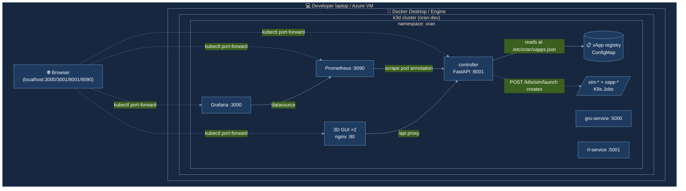
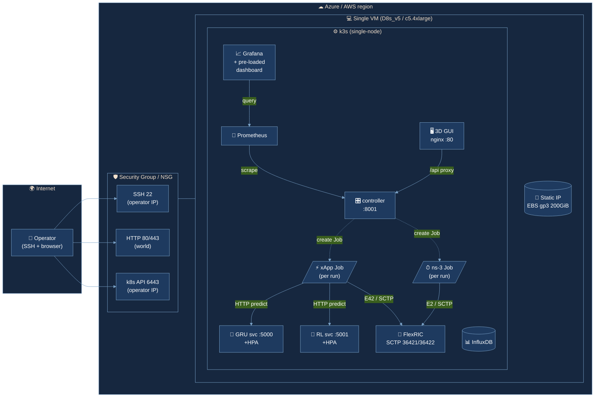

# 5G O-RAN Intelligent Network Management Platform

> A full-stack, software-defined 5G O-RAN platform: ns-3 mmWave RAN simulator + FlexRIC near-RT RIC + three pluggable AI xApps (GRU, RL, AWF) + a 3D command-center GUI, all orchestrated by a FastAPI controller and shippable as a Helm chart on Kubernetes.

[](https://github.com/AI-Driven-Digital-Twin-for-O-RAN/Mohamed/actions/workflows/lint.yml)
[](https://github.com/AI-Driven-Digital-Twin-for-O-RAN/Mohamed/actions/workflows/unit-tests.yml)
[](https://github.com/AI-Driven-Digital-Twin-for-O-RAN/Mohamed/actions/workflows/smoke.yml)
[](https://github.com/AI-Driven-Digital-Twin-for-O-RAN/Mohamed/actions/workflows/build.yml)

Graduation project under an **Orange** research initiative.

---

## Table of contents

1. [What this is](#1-what-this-is)
2. [System architecture](#2-system-architecture)
3. [Repository structure](#3-repository-structure)
4. [The xApps — multi-xApp registry pattern](#4-the-xapps--multi-xapp-registry-pattern)
5. [How to run](#5-how-to-run)
   - [Quick start — local Kubernetes](#5a-quick-start--local-kubernetes-k3d--helm-recommended)
   - [Local dev — Docker Compose](#5b-local-dev--docker-compose)
   - [Native host mode](#5c-native-host-mode-for-real-ns-3-runs)
   - [AWS cloud reference](#5d-aws-cloud-reference)
6. [Building the heavy images (FlexRIC + ns-3)](#6-building-the-heavy-images-flexric--ns-3)
7. [Testing](#7-testing)
8. [Observability](#8-observability)
9. [CI/CD](#9-cicd)
10. [Architecture Decision Records](#10-architecture-decision-records)
11. [GRU model — handover optimization](#11-gru-model--handover-optimization)
12. [Ping-pong avoidance logic](#12-ping-pong-avoidance-logic)
13. [Key parameters reference](#13-key-parameters-reference)
14. [Troubleshooting](#14-troubleshooting)
15. [Team](#15-team)
16. [Acknowledgements](#16-acknowledgements)

---

## 1. What this is

A complete, software-only **5G O-RAN platform** that simulates a real mmWave network (8 cells, 20 UEs) and runs AI-driven xApps that make real-time handover decisions over the standard E2 interface. Three xApps ship today:

| xApp | Decision strategy | Owner |
|---|---|---|
| **GRU handover** | A trained GRU neural network predicts whether each handover would cause a ping-pong, using 10 × 12 KPM/SINR features. EXECUTE if ToS ≥ 1.2 s, else AVOID. | Fares Esmail |
| **RL handover** | A DDQN agent learns the optimal handover policy from a normalized 8-feature state × 5-step sliding window. | Omar Salama |
| **AWF load balancing** | The Adaptive Weight Function rebalances UEs across cells using `score = w₁·RSRPpilot + w₂·(1 − load) + w₃·history` (Gures et al., ICT Express 2023). | Yousef Fathy |

Adding a fourth xApp is **one entry in `charts/oran/values.yaml`** + a Docker push — no template, controller, or GUI changes. See [ADR 0001](docs/ADR/0001-multi-xapp-registry-pattern.md).

---

## 2. System architecture

### Local development (k3d)



> Source: [docs/images/local-k3d-architecture.mmd](docs/images/local-k3d-architecture.mmd) · render to PNG with `make diagrams`.

### Cloud reference (single-VM k3s on Azure / AWS)



> Source: [docs/images/cloud-architecture.mmd](docs/images/cloud-architecture.mmd) · cost shape + provisioning details in [docs/CLOUD.md](docs/CLOUD.md).

### Component-level data flow (legacy ASCII)

```
                                  ┌────────────────────────────────────────┐
                                  │  Operator browser / kubectl / curl     │
                                  └───────────────────┬────────────────────┘
                                                      │
                                                      ▼
                       ┌──────────────────────────────────────────────────┐
                       │  Kubernetes  (k3d local · k3s on a cloud VM)     │
                       │                                                  │
                       │  ┌────────────┐    ┌────────────────────────┐    │
                       │  │ ingress    │───►│  3D GUI (Vite + nginx) │    │
                       │  │ -nginx     │    │  /api → controller     │    │
                       │  └────────────┘    └────────────┬───────────┘    │
                       │                                 │                │
                       │                       ┌─────────▼──────────┐     │
                       │                       │  FastAPI Controller│     │
                       │                       │  /healthz /metrics │     │
                       │                       │  /ctrl/*  (host)   │     │
                       │                       │  /k8s/*   (Jobs)   │     │
                       │                       └─────┬──────────────┘     │
                       │                             │ creates Jobs       │
                       │ ┌──────────────────┐  ┌─────▼─────────────────┐  │
                       │ │ FlexRIC near-RT  │  │  ns-3 sim Job (batch) │  │
                       │ │ RIC (SCTP 36421) │◄─│  + xApp Job (binary)  │  │
                       │ └──────────────────┘  │    in FlexRIC image   │  │
                       │       ▲               └───────────────────────┘  │
                       │       │ E2/SCTP                                  │
                       │ ┌─────┴────────┐ ┌──────────────┐ ┌────────────┐ │
                       │ │ GRU service  │ │ RL service   │ │ Prometheus │ │
                       │ │ Flask :5000  │ │ Flask :5001  │ │  scrapes   │ │
                       │ │ +HPA(2-5)    │ │ +HPA(2-5)    │ │  /metrics  │ │
                       │ └──────────────┘ └──────────────┘ └─────┬──────┘ │
                       │                                         │        │
                       │                                  ┌──────▼──────┐ │
                       │  ┌────────────┐  ┌────────────┐  │  Grafana    │ │
                       │  │ InfluxDB   │  │ 2D Grafana │  │  (auto-     │ │
                       │  │ time series│  │ dashboard  │  │  loaded)    │ │
                       │  └────────────┘  └────────────┘  └─────────────┘ │
                       └──────────────────────────────────────────────────┘
                                                ▲
                                                │ helm upgrade --install
                                                │
                       ┌────────────────────────┴────────────────────────┐
                       │  GitHub Actions: lint · unit-tests · smoke      │
                       │  build → Docker Hub (mohamed710/*)               │
                       └─────────────────────────────────────────────────┘
```

| Component | Image | Port(s) | Role |
|---|---|---|---|
| FastAPI Controller | `mohamed710/oran-controller` | `:8001` | Drives sims (host subprocess or K8s Jobs); exposes `/metrics` |
| 3D GUI | `mohamed710/oran-gui` | `:80` (LB :3001) | Vite + Three.js scene polling controller via nginx `/api` proxy |
| GRU Service | `mohamed710/xapp-gru-service` | `:5000` | Flask wrapper around the trained Keras model |
| RL Service | `mohamed710/xapp-rl-service` | `:5001` | Flask wrapper around the DDQN policy network |
| FlexRIC near-RT RIC | `mohamed710/flexric` | `:36421/sctp`, `:36422/sctp` | E2 termination, xApp lifecycle, RC control |
| ns-3 mmWave | `mohamed710/ns3-mmwave` | (Job) | The simulator. One Job per simulation run. |
| InfluxDB | `influxdb:1.8-alpine` | `:8086` | Time-series store for KPM data |
| Grafana | `grafana/grafana:10.4.2` | `:3000` | Dashboards (pre-loaded "O-RAN platform — overview") |
| Prometheus | `prom/prometheus:v2.55.1` | `:9090` | Scrapes pods via annotations |

---

## 3. Repository structure

```
graduation-project/
├── platform/                      ← infrastructure + orchestration
│   ├── controller/                FastAPI orchestrator (host + K8s Jobs)
│   ├── gui/                       Vite + Three.js 3D GUI
│   ├── flexric/                   FlexRIC near-RT RIC (vendored, upstream Dockerfile)
│   │   └── docker/Dockerfile.flexric.ubuntu   ← used by `make image-build-flexric`
│   ├── ns3-sim/                   ns-3 mmWave-LENA-oran scenarios
│   │   ├── Dockerfile             our multi-stage build
│   │   └── mmwave-LENA-oran/      the simulator tree
│   └── 2d-gui/                    legacy Grafana stack (Docker-only)
├── xapps/                         ← per-xApp tree (registry pattern)
│   ├── gru-handover/
│   │   ├── README.md
│   │   ├── python-service/        gru_xapp.py + Dockerfile + requirements
│   │   ├── model/                 handover_model_final.keras
│   │   ├── artifacts/             scaler.joblib, config.joblib
│   │   ├── training/              Handover_Optimization.ipynb + predict.py
│   │   └── dev-scratch/           Yousef's C iteration history
│   ├── rl-handover/
│   │   ├── python-service/        rl_xapp.py + agent.py + models/
│   │   └── training/              train_rl_ns3*.py + Datasets + Results
│   └── lb-awf/                    placeholder; binary lives in FlexRIC image
├── charts/oran/                   ← Helm chart (27 K8s resources)
│   ├── Chart.yaml
│   ├── values.yaml                xApp registry, FlexRIC, ns-3, observability
│   └── templates/
│       ├── controller-*.yaml      Deployment + Service + PVC + RBAC
│       ├── gui-*.yaml             Deployment + Service + Ingress
│       ├── xapps.yaml             registry iteration → per-xApp resources
│       ├── xapp-registry-configmap.yaml   read by the controller at runtime
│       ├── flexric.yaml           Deployment + SCTP Service
│       ├── prometheus.yaml        scraper + RBAC
│       └── grafana*.yaml          Deployment + datasource + dashboard
├── infra/terraform/aws/           ← cloud reference (single-VM k3s on EC2)
├── tools/                         ← shell scripts + utilities
│   ├── gru.sh, rl.sh, kill_sim.sh
│   ├── start.sh, save_sim_results.sh, launch_gru_system.sh
│   └── docs-generation/           PDF generators for the thesis
├── docs/                          ← documentation
│   ├── ADR/                       6 architecture decision records
│   ├── CLOUD.md                   AWS reference architecture, cost model
│   ├── *.pdf                      thesis chapters and guides
│   ├── MANUAL_COMMANDS.txt
│   ├── demo/                      live demo HTML
│   └── yousef-notes/              Yousef's README + screenshots
├── tests/unit/                    ← pytest tests (18 tests, controller pure functions)
├── sim-results/                   ← per-run simulation output
├── .github/workflows/             ← CI: lint + unit-tests + smoke + build
├── docker-compose.dev.yml         ← local supporting cast (controller, GUI, Influx, Grafana)
├── pyproject.toml                 ← pytest + ruff config
├── Makefile                       ← single discoverable entrypoint
└── .env.example                   ← all env vars documented
```

Run `make help` to see every available command.

---

## 4. The xApps — multi-xApp registry pattern

Each xApp is **one entry** in `charts/oran/values.yaml`:

```yaml
xapps:
  gru-handover:
    enabled: true
    pythonService:
      enabled: true
      image:    { repository: xapp-gru-service, tag: "" }
      port:     5000
      replicas: 1
      autoscaling: { enabled: false, minReplicas: 1, maxReplicas: 5 }
    cxapp:
      image:  { repository: "" }   # empty → use FlexRIC image
      binary: /usr/local/flexric/xApp/c/handover_gru/xapp_handover_gru
    config:
      indicationPeriodicity: 0.05
      cells: 7
      e2FunctionIdKpm: 2
```

Helm renders Deployment + Service + (optional) HorizontalPodAutoscaler per entry. The same data is exposed as JSON via a ConfigMap and consumed by the controller's `k8s_client.read_xapp_registry()` to spawn xApp Jobs at runtime.

**Adding a fourth xApp** (e.g. an MPC controller):

1. Add an `mpc-handover:` block under `xapps:` in `values.yaml`.
2. `make image-build-<your-image> && make image-push`.
3. `make deploy` — the new xApp is live.

No code changes anywhere else. See [ADR 0001](docs/ADR/0001-multi-xapp-registry-pattern.md) for the full reasoning.

---

## 5. How to run

There are **four ways** to run the platform, depending on what you want to do.

### 5a. Quick start — local Kubernetes (k3d + Helm) — **recommended**

The full DevOps stack on your laptop in 15 minutes (assumes Docker Desktop with WSL/Linux integration is on).

```bash
# Prereqs (one-time, no sudo needed):
mkdir -p ~/.local/bin && export PATH=~/.local/bin:$PATH
curl -sSL https://github.com/k3d-io/k3d/releases/download/v5.7.4/k3d-linux-amd64 \
  -o ~/.local/bin/k3d && chmod +x ~/.local/bin/k3d
KUBE=$(curl -sL https://dl.k8s.io/release/stable.txt) && \
  curl -sLo ~/.local/bin/kubectl https://dl.k8s.io/release/$KUBE/bin/linux/amd64/kubectl && \
  chmod +x ~/.local/bin/kubectl
curl -sSL https://get.helm.sh/helm-v3.16.4-linux-amd64.tar.gz | tar xz -C /tmp && \
  mv /tmp/linux-amd64/helm ~/.local/bin/

# Bring up the platform:
make k3d-up              # creates k3d cluster `oran-dev`
make image-build         # 4 light images (controller, gui, gru, rl) — ~5 min
make k3d-import          # ships local images into the cluster (no registry push)
make deploy              # helm upgrade --install — 5-10 min on first run

# Verify:
make k8s-status

# Open the dashboards (port-forwards run in background):
kubectl port-forward -n oran svc/oran-oran-grafana    3000:3000 &  # admin/admin
kubectl port-forward -n oran svc/oran-oran-controller 8001:8001 &
kubectl port-forward -n oran svc/oran-oran-gui        3001:80   &
kubectl port-forward -n oran svc/oran-oran-prometheus 9090:9090 &

# Now open in browser:
#   http://localhost:3001    3D O-RAN GUI
#   http://localhost:3000    Grafana — "O-RAN platform — overview" pre-loaded
#   http://localhost:9090    Prometheus
#   http://localhost:8001/healthz   /readyz   /metrics   /k8s/health   /k8s/xapps

# Launch a (demo-mode) simulation Job pair:
curl -sS -X POST http://localhost:8001/k8s/sim/launch \
    -H 'Content-Type: application/json' \
    -d '{"scenario":"gru_scenario","xapp_id":"gru-handover","sim_time":60}'

# Watch the Jobs run to completion (~45s in demo mode):
kubectl get jobs -n oran -w
```

When you're done:

```bash
make undeploy            # helm uninstall
make k3d-down            # delete the cluster
```

> **Demo mode:** the chart ships with `K8S_DEMO_MODE=true`, which makes the controller create busybox-stub Jobs that *log what they would do* and exit cleanly in 45 seconds. Switch to real ns-3 + FlexRIC by building the heavy images (Section 6) and setting `--set controller.env.K8S_DEMO_MODE=false`. See [ADR 0005](docs/ADR/0005-k8s-demo-mode.md).

### 5b. Local dev — Docker Compose

For iterating on the controller / GUI / Python services without standing up a cluster.

```bash
make compose-up-detach   # build + start: controller, gui, gru-service, rl-service, influxdb, grafana
make compose-logs        # tail
make compose-down        # stop + remove
```

Endpoints:

- http://localhost:3001 — 3D GUI
- http://localhost:8001/healthz, `/metrics`, `/ctrl/status` — controller
- http://localhost:3000 — Grafana (admin/admin, no dashboards in compose mode)
- http://localhost:8086 — InfluxDB ping

> The controller's `/k8s/*` endpoints will report `available: false` in compose mode (no cluster). Use `/ctrl/*` or switch to k3d.

### 5c. Native host mode (for real ns-3 runs)

The original way, before everything was containerized. Useful when you're debugging FlexRIC or the C xApps natively.

```bash
make install             # venv + Python deps + npm install
make build-info          # prints the FlexRIC + ns-3 build recipe (run once)
# ... build FlexRIC + ns-3 per the recipe (30-60 min combined) ...

# Then either:
make controller          # terminal A — FastAPI on :8001
make gui                 # terminal B — Vite on :3001

# Or use the legacy launchers:
make up SCENARIO=gru SIM_TIME=60 N_UES=20 N_CELLS=7
make up SCENARIO=rl SIM_TIME=60 N_UES=20 N_CELLS=7
make down                # kills everything
```

`make doctor` triages what's missing.

### 5d. AWS cloud reference

A single-VM k3s deployment of the full stack. **Validated, not yet applied** (real money). See [docs/CLOUD.md](docs/CLOUD.md) for the topology, cost model, and rationale.

```bash
# Prereqs (one-time):
aws configure
aws ec2 create-key-pair --key-name oran-demo --query KeyMaterial \
    --output text > ~/.ssh/oran-demo.pem
chmod 400 ~/.ssh/oran-demo.pem

# Apply:
make tf-init
TF_VAR_key_name=oran-demo \
TF_VAR_operator_cidr=$(curl -s https://ifconfig.me)/32 \
TF_VAR_use_spot=true \
TF_VAR_auto_shutdown_minutes=240 \
make tf-apply

# 7-10 min later:
ssh ubuntu@$(cd infra/terraform/aws && terraform output -raw public_ip)
# Then on the host: cd /opt/oran && helm install oran charts/oran -n oran --create-namespace

# Tear down (returns to $0):
make tf-destroy
```

Cost: **~$2 for a 6-hour defense-day session** with Spot pricing and auto-shutdown. ~$10/mo for weekly iteration. Multi-AZ EKS would be wasteful for this workload (see [docs/CLOUD.md § Why not multi-AZ EKS](docs/CLOUD.md#why-not-multi-az-eks)).

---

## 6. Building the heavy images (FlexRIC + ns-3)

These are the only "real" simulator images. Builds are slow:

| Image | First build | Size | Recipe |
|---|---|---|---|
| `mohamed710/flexric:dev` | ~30 min | ~2 GB | upstream multi-stage build at `platform/flexric/docker/Dockerfile.flexric.ubuntu` |
| `mohamed710/ns3-mmwave:dev` | ~30-60 min | ~3-4 GB | `platform/ns3-sim/Dockerfile` — builds e2sim-kpmv3 + ns-3 + scenarios |

```bash
# Both, sequentially (recommended on a 16 vCPU / 32 GB machine):
make image-build-heavy

# Or one at a time:
make image-build-flexric
make image-build-ns3

# Then use them in the cluster:
make k3d-import          # ships local images into k3d
helm upgrade oran charts/oran -n oran \
    --set controller.env.K8S_DEMO_MODE=false   # flip to real mode
```

The FlexRIC image bakes **every C xApp** (handover_gru, handover_rl, lb_awf, plus Yousef's new `orange/xapp_es_with_cell_util*` and `orange/LB`) into the same image at `/usr/local/flexric/xApp/c/<id>/`. xApp Jobs reuse this image and just override the entrypoint. See [ADR 0003](docs/ADR/0003-single-flexric-image.md).

---

## 7. Testing

```bash
# Unit tests — controller pure functions (18 tests):
make test
make test-cov            # with coverage

# Local Helm validation (offline, no cluster):
make helm-lint           # lint + dry-render
make helm-template       # full rendered output

# Smoke test (requires Docker + k3d):
# This is what runs in CI on every PR.
make k3d-up && make image-build && make k3d-import
make deploy
curl -sS -X POST http://localhost:8001/k8s/sim/launch \
    -d '{"scenario":"gru_scenario","xapp_id":"gru-handover","sim_time":60}'
kubectl wait --for=condition=complete -n oran job/sim-r<id> --timeout=120s
```

The unit tests caught a real bug during Phase 5 — `_build_decision_log` used `defaultdict` without importing it at module level. Fixed in commit history.

---

## 7b. Screenshots & demo evidence

Reproducible artifacts captured during a live demo session on Azure. Filenames follow `docs/images/<n>-<slug>.png` so they slot directly into the thesis figure list.

| # | What it shows | How to capture | File |
|---|---|---|---|
| 1 | `make doctor` output — env vars + tooling + paths green | Run `make doctor` on the VM; screenshot the terminal | [`docs/images/01-doctor.png`](docs/images/01-doctor.png) |
| 2 | `make test` — 18/18 unit tests passing | Run `make test`; screenshot the last 5 lines | [`docs/images/02-unit-tests.png`](docs/images/02-unit-tests.png) |
| 3 | `helm lint` clean + 27 K8s resource counts | `make helm-lint && helm template oran charts/oran \| grep "^kind:" \| sort \| uniq -c` | [`docs/images/03-helm-lint.png`](docs/images/03-helm-lint.png) |
| 4 | `kubectl get pods -n oran` — 6 Running 1/1 | After `make deploy`, capture the table | [`docs/images/04-pods-running.png`](docs/images/04-pods-running.png) |
| 5 | The 3D GUI in the browser — towers + UEs + KPI bar | `http://<VM-IP>:3001` | [`docs/images/05-3d-gui.png`](docs/images/05-3d-gui.png) |
| 6 | The Grafana dashboard — populated with sim006 reference values | `http://<VM-IP>:3000` → admin/admin → "O-RAN platform — overview" | [`docs/images/06-grafana-dashboard.png`](docs/images/06-grafana-dashboard.png) |
| 7 | `kubectl get jobs -n oran` after multi-scenario run | `bash tools/run-multi-scenario.sh --parallel` then capture the final state | [`docs/images/07-jobs-table.png`](docs/images/07-jobs-table.png) |
| 8 | Browser DevTools Network tab on `LAUNCH ALL` click — `mode: "k8s"` in response | F12 → Network → click LAUNCH ALL → expand the POST `/ctrl/launch-all` row | [`docs/images/08-launch-all-network.png`](docs/images/08-launch-all-network.png) |
| 9 | `curl /metrics \| grep oran_` — live Prometheus metrics | Run on the VM | [`docs/images/09-metrics-curl.png`](docs/images/09-metrics-curl.png) |
| 10 | Prometheus targets — controller scraped UP | `http://<VM-IP>:9090/targets` | [`docs/images/10-prometheus-targets.png`](docs/images/10-prometheus-targets.png) |
| 11 | GitHub Actions all green | `https://github.com/AI-Driven-Digital-Twin-for-O-RAN/Mohamed/actions` | [`docs/images/11-actions-green.png`](docs/images/11-actions-green.png) |
| 12 | The xApp registry ConfigMap rendered | `kubectl get cm oran-oran-xapp-registry -n oran -o jsonpath='{.data.xapps\.json}' \| jq` | [`docs/images/12-xapp-registry.png`](docs/images/12-xapp-registry.png) |

> **For the thesis book:** these are the figures that map 1:1 to the chapters — Section 4 (registry pattern) uses #12, Section 5 (deployment) uses #4 and #11, Section 6 (observability) uses #6, #9, #10, Section 7 (validation) uses #2, #3, #7, #8.
>
> Drop the captured PNGs into `docs/images/` with the exact filenames above and they appear in the rendered README automatically.

---

## 8. Observability

The controller exposes Prometheus metrics at `/metrics`:

```
oran_simulations_total{xapp,scenario}     completed sims, by xapp + scenario
oran_handovers_total{xapp,result}         handover events (success | pingpong)
oran_pingpong_rate_pct{xapp}              from latest sim
oran_decision_accuracy_pct{xapp}          from latest sim
oran_e2_connections                       live count (from `ss -anp ESTAB :36421`)
oran_component_up{component}              1/0 per docker, flexric, simulation, pusher, xapp
oran_decision_latency_seconds_bucket{xapp}   histogram
```

Prometheus discovers the controller via the `prometheus.io/scrape: "true"` annotation on the pod. Grafana auto-loads the **`O-RAN platform — overview`** dashboard from the chart's ConfigMap with panels for component health, ping-pong rate, decision accuracy, handovers/min, and decision latency heatmap.

`/healthz` (liveness) and `/readyz` (readiness — checks for FlexRIC/ns-3 binaries on disk) round out the probe surface.

---

## 9. CI/CD

Four GitHub Actions workflows fire on every PR + push to `main`:

| Workflow | What it does | Typical runtime |
|---|---|---|
| **`lint.yml`** | ruff (Python), shellcheck, hadolint, yamllint, Vite build smoke | 2-3 min |
| **`unit-tests.yml`** | `pytest tests/unit/` with coverage report | 1-2 min |
| **`smoke.yml`** | Spins up k3d in CI, deploys the chart, hits `/k8s/sim/launch`, asserts demo Jobs reach Complete with the expected log content | 6-10 min |
| **`build.yml`** | Matrix builds + pushes 4 images to Docker Hub on `main` and on tags | 5-8 min |

Add `DOCKERHUB_TOKEN` to the repo secrets to enable `build.yml`'s push step. Without it, builds run but skip push.

---

## 10. Architecture Decision Records

Six short markdown docs in [`docs/ADR/`](docs/ADR/) capture the *why* behind every significant architectural choice:

| # | Title | One-line justification |
|---|---|---|
| [0001](docs/ADR/0001-multi-xapp-registry-pattern.md) | Multi-xApp registry pattern | Adding xApp N = one entry in `values.yaml` + `docker push`. Zero code changes. |
| [0002](docs/ADR/0002-ns3-simulation-as-k8s-job.md) | ns-3 sim as a K8s Job | Defined end + single-process → matches Job semantics, not Deployment. |
| [0003](docs/ADR/0003-single-flexric-image.md) | Single FlexRIC image, override per xApp | Build once, deploy three ways. Image storage, build time, update flow all win. |
| [0004](docs/ADR/0004-dual-mode-controller.md) | Dual-mode controller (host + K8s) | Demo-day fallback: K8s → host → recorded results. |
| [0005](docs/ADR/0005-k8s-demo-mode.md) | `K8S_DEMO_MODE` for orchestration verification | Verified the K8s control loop without waiting for the heavy ns-3/FlexRIC builds. |
| [0006](docs/ADR/0006-path-portability-via-project-root.md) | Path portability via `PROJECT_ROOT` | One env var = no hardcoded paths anywhere. Foundation for everything else. |

Suggested reading order for the defense committee: **0006 → 0001 → 0003 → 0002 → 0004 → 0005**.

---

## 11. GRU model — handover optimization

| Property | Value |
|---|---|
| Architecture | 2-layer GRU (128 → 64) → Dense(128, relu) → Dropout(0.3) → ToS head + 3-class softmax head |
| Input shape | 10 timesteps × 12 features |
| Features | Level (RSRP), Qual (RSRQ), SNR, CQI, SecondCell_RSRP, SecondCell_SNR, NRxLev1, NQual1, Speed, DL_bitrate, UL_bitrate, BANDWIDTH |
| Decision | EXECUTE (probability-of-pingpong < threshold) or AVOID |
| Threshold | `ToS_th = 1.2 s`, `ToS_unnec_th = 1.35 s` (in `Fares/artifacts/config.joblib`) |
| Indication interval | **0.05 s** — must match training; at 0.1 s the model saturates to 99.8 % AVOID |
| Inference path | C xApp posts JSON to `http://gru-service:5000/predict`, gets `{decision, confidence, ToS}` back |

The training notebook is in [`xapps/gru-handover/training/Handover_Optimization.ipynb`](xapps/gru-handover/training/Handover_Optimization.ipynb).

---

## 12. Ping-pong avoidance logic

A **ping-pong handover** = a UE goes A→B and then B→A within 5 simulated seconds. It wastes resources and degrades QoS.

```python
# Per-UE grouping is critical — see the regression test.
ue_history = defaultdict(list)
for r in executed_handovers:
    ue_history[r['ue_id']].append((time, from_cell, to_cell))

ping_pong = 0
for ue, hovers in ue_history.items():
    for i in range(1, len(hovers)):
        prev_t, prev_from, prev_to = hovers[i-1]
        curr_t, curr_from, curr_to = hovers[i]
        if (curr_to == prev_from and curr_from == prev_to
                and (curr_t - prev_t) <= 5.0):
            ping_pong += 1
```

A naive global sequential scan (the original implementation) misses ping-pongs when handovers from different UEs interleave in the CSV. The fix is in `controller._calc_pingpong` and is regression-tested in [`tests/unit/test_calc_pingpong.py::test_interleaved_handovers_are_grouped_per_ue`](tests/unit/test_calc_pingpong.py).

---

## 13. Key parameters reference

| Parameter | Value | Where set | Why this value |
|---|---|---|---|
| `indicationPeriodicity` (GRU) | **0.05 s** | controller env / values.yaml | Matches GRU training conditions |
| `indicationPeriodicity` (LB) | **1.5 s** | values.yaml lb-awf | LB only needs aggregate stats |
| `simTime` | 60 s | `make up SIM_TIME=…` | ~3 hours wall-clock per 60 sim-seconds |
| `N_Ues` | 20 | values.yaml + `make up N_UES=…` | Reference scenario spec |
| `N_MmWaveEnbNodes` | 7 (GRU) / 8 (LB) | values.yaml per-xApp | Reference scenario spec |
| `hoSinrDifference` | 3 dB | values.yaml per-xApp | A3 event trigger threshold |
| `GRU_PORT` / `RL_PORT` | 5000 / 5001 | env / values.yaml | Flask service ports |
| Controller port | 8001 | controller / chart | host + K8s |
| Frontend port | 3001 → 80 | vite / chart | dev → container |
| Grafana / Prometheus | 3000 / 9090 | chart | standard upstream |
| Ping-pong window | 5.0 s | controller `_calc_pingpong` | 3GPP standard ping-pong definition |
| FlexRIC SCTP E2 / E42 | 36421 / 36422 | flexric.conf + chart | E2AP standard |
| K3D cluster name | `oran-dev` | Makefile var | Override with `K3D_CLUSTER=…` |
| Helm release / namespace | `oran` / `oran` | Makefile var | Override with `HELM_RELEASE=…`, `HELM_NS=…` |

---

## 14. Troubleshooting

### `make compose-up` fails with `exec format error: docker-credential-desktop.exe`

WSL can't invoke the Windows-side cred helper. Patch `~/.docker/config.json`:

```bash
echo '{"auths":{"https://index.docker.io/v1/":{}}}' > ~/.docker/config.json
```

### `helm upgrade --install` times out at `--wait`

Either an image is failing to pull (`kubectl describe pod` to confirm) or the controller's `/readyz` is reporting 503 because FlexRIC/ns-3 binaries don't exist *inside the container*. The chart's `readinessProbe` for the controller in cluster uses `/healthz`, not `/readyz`, exactly to avoid this — confirm by checking [charts/oran/templates/controller-deployment.yaml](charts/oran/templates/controller-deployment.yaml).

### xApp pod `ImagePullBackOff` on `mohamed710/xapp-*`

You haven't run `make image-build && make k3d-import` yet, OR you're in real mode with the heavy images not built. Either build them (Section 6) or stay in `K8S_DEMO_MODE=true`.

### Prometheus shows the controller target as `up` but no `oran_*` metrics

The controller's `/metrics` is self-refreshing — every scrape recalculates the gauges. Confirm the scrape worked:

```bash
curl http://localhost:8001/metrics | grep oran_
```

If empty, the controller hasn't completed boot. Check `kubectl logs deploy/oran-oran-controller`.

### Component label collision in Grafana panels (`controller / controller / controller / controller / controller`)

Fixed in [charts/oran/templates/prometheus.yaml](charts/oran/templates/prometheus.yaml) — the relabel uses `pod_component` instead of overwriting the metric's own `component` label. If you regress this, ping-pong/accuracy panels will show the same value for every component.

### `xApp prints "Insufficient samples 1/2" — 0 handovers` (host mode)

The xApp started too late (>60s after sim began), not enough KPM samples accumulated. Always do `make down` before re-running, ensure `/tmp/flexric.log` is empty, and wait for `N` E2 SETUP-REQUESTs in the FlexRIC log before letting the xApp connect.

### `FlexRIC crashes — "assertion sr->len_e2_nodes_conn > 0 failed"` (host mode)

A stale xApp from a previous crashed run reconnected before ns-3 did. `make down` (which kills everything) before every new run.

### `make doctor` reports GRU model MISSING

Fares' model files should live at `xapps/gru-handover/{model,artifacts}/`. If they're missing on a fresh clone, see the historical Fares submodule path or `cp` from a backup checkout.

### `git status` shows ~16,000 changed files after first push prep

Most of those are restructure renames git hasn't been told about yet (every file under `yousef_fathy/...` was moved to `platform/...`). Two strategies:

```bash
# A) One commit covering everything (fastest):
git add -A && git commit -m "DevOps platform: restructure + Helm + K8s + observability + ADRs + cloud"

# B) Logical commits (better history for the defense):
git add platform/ tools/ docs/yousef-notes/ Makefile && git commit -m "Repo restructure"
git add charts/ && git commit -m "Helm chart with multi-xApp registry"
git add platform/controller/ && git commit -m "Controller K8s API integration"
git add tests/ pyproject.toml && git commit -m "Unit tests + pytest config"
git add .github/ && git commit -m "CI workflows"
git add docs/ADR/ && git commit -m "Architecture Decision Records"
git add docs/CLOUD.md infra/ && git commit -m "AWS Terraform reference"
```

Review `git status | head -50` before any `git add -A`.

---

## 15. Team

| Role | Owner | Owns |
|---|---|---|
| **DevOps / Integrator** | Mohamed Moustafa <mhmdmstfa710@gmail.com> | `platform/controller/`, `platform/gui/`, `charts/oran/`, `infra/`, `Makefile`, CI workflows, ADRs |
| **GRU model** | Fares Esmail | `xapps/gru-handover/{model,artifacts,training}/` — the Keras handover optimization model |
| **FlexRIC + ns-3 stack** | Yousef Fathy | `platform/flexric/`, `platform/ns3-sim/`, the C xApps under `examples/xApp/c/{handover_gru,handover_rl,lb_awf,orange}/`, the original `HANDOVER_xApp_Test/` source tree |
| **RL xApp** | Omar Salama | `xapps/rl-handover/{python-service,training}/` — DDQN handover policy network |

---

## 16. Acknowledgements

- **Orange Research Initiative** — sponsorship and the O-RAN research direction.
- **OpenAirInterface FlexRIC** — the near-RT RIC implementation we vendor at `platform/flexric/`.
- **ns-3 Consortium + mmWave-LENA-oran fork** — the simulator core and 5G mmWave model.
- **OSC (O-RAN Software Community)** — KPM v3 and RC v1 service models.
- The team listed above for the AI components and the original platform integration.

---

**License:** This project is a graduation deliverable. Component licenses follow upstream:
FlexRIC (OAI Public License 1.1), ns-3 (GNU GPLv2), Three.js (MIT). For the Orange-funded
contributions in this repo, contact the maintainer for licensing terms.
